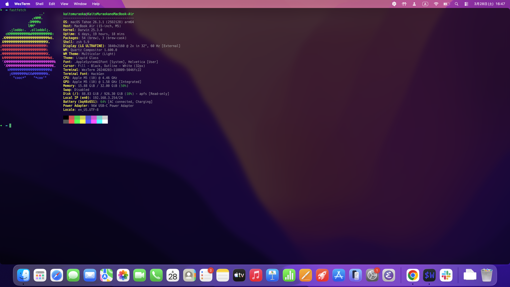

# wezterm_lua

A repository for managing [WezTerm](https://wezfurlong.org/wezterm/) configuration files.

`.wezterm.lua` is the main configuration file for WezTerm.



## Configuration (`.wezterm.lua`)

- **Window size**: Initial size set to 80 columns x 24 rows
- **Font size**: 17pt
- **Font**: `Glass TTY VT220` (retro-style font)

### Available Fonts

The configuration file includes retro-style fonts. You can switch between them by changing the argument of `config.font`.

- [`Glass TTY VT220` (currently in use)](https://caglrc.cc/glasstty/)
- [`Print Char 21`](https://www.kreativekorp.com/software/fonts/apple2/)
- `Nu Anko Mochi`

## Usage

Create a symbolic link or copy this file to your home directory.

```bash
ln -s $(pwd)/.wezterm.lua ~/.wezterm.lua
```
