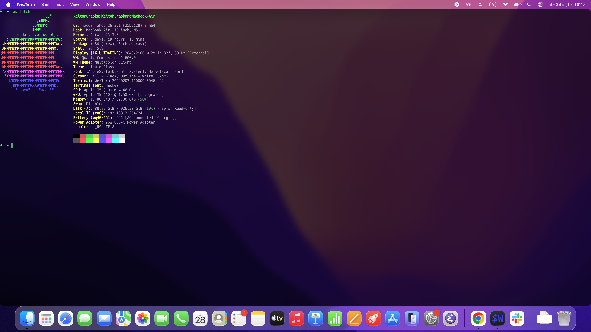

# wezterm_lua

A repository for managing [WezTerm](https://wezfurlong.org/wezterm/) configuration files.

`.wezterm.lua` is the main configuration file for WezTerm.



## Configuration (`.wezterm.lua`)

- **Window size**: Initial size set to 80 columns x 24 rows
- **Font**: `HackGen` (weight: Medium)
- **Font size**: 13pt
- **Background opacity**: 0.7 (translucent)
- **Background blur**: 30 (macOS)
- **Window decorations**: Title bar and resize controls (`RESIZE|TITLE`)
- **Tab bar**: Hidden when only one tab is open
- **Window padding**: None (0 on all sides)
- **Option key**: Both left and right Alt keys act as Meta key (not as composed key)

## Usage

Create a symbolic link or copy this file to your home directory.

```bash
ln -s $(pwd)/.wezterm.lua ~/.wezterm.lua
```
